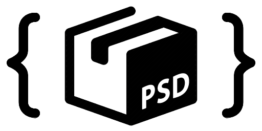

<p align="center"></p>

# @webtoon/psd

[](https://www.npmjs.com/package/@webtoon/psd) [](https://bundlephobia.com/package/@webtoon/psd)

> A lightweight Adobe Photoshop .psd/.psb file parser in typescript with zero-dependency for web browsers and NodeJS

`@webtoon/psd` is a fast, lightweight parser for Adobe Photoshop PSD/PSB files. It uses standard (ES2015+) features and can be used both in web browsers and in Node.js. It pulls in zero dependencies, making it smaller ([~73 KiB minified](https://bundlephobia.com/package/@webtoon/psd@0.2.0)) than other PSD parsers ([ag-psd]: [200 KiB](https://bundlephobia.com/package/ag-psd@15.0.0), [PSD.js]: [443 KiB](https://github.com/meltingice/psd.js/blob/master/dist/psd.min.js)). It uses WebAssembly to speed up decoding image data.

[ag-psd]: https://github.com/Agamnentzar/ag-psd
[psd.js]: https://github.com/meltingice/psd.js

## Browser Support

| Chrome | Firefox | Safari | Edge | Node |
| :----: | :-----: | :----: | :--: | :--: |
|   57   |   52    |   11   |  79  |  12  |

\*Internet Explorer is not supported

## Installation

```bash
$ npm install @webtoon/psd
```

## Benchmarks

You can run [benchmarks for @webtoon/psd in your browser](https://webtoon.github.io/psd/benchmark/).

## Features

#### ✅ Supported

- Support large format (`.psb`)
- Image / Layer information (size, offset, etc.)
- Image / Layer pixel data
- Unicode layer names
- Image / Layer opacity
- Text layers string value
- Guides
- Slices

#### 🚧 Work in progress

- Layer effects (shadow, overlays, etc.)

#### ❌ Unsupported

- Photoshop metadata not directly related to the image

## Usage

`@webtoon/psd` is provided as a pure ECMAScript module.

### Web Browsers

Check out the [live demo](https://webtoon.github.io/psd) ([source code](https://github.com/webtoon/psd/tree/main/packages/example-browser)) for web browser.

`@webtoon/psd` must be bundled with a bundler such as Webpack or Rollup.

`@webtoon/psd` reads a PSD file as an `ArrayBuffer`. You can use `FileReader` or `File` to load a PSD file:

```ts
import Psd from "@webtoon/psd";

const inputEl: HTMLInputElement = document.querySelector("input[type='file']");
inputEl.addEventListener("change", async () => {
  const file = inputEl.files[0];

  const result = await file.arrayBuffer();
  const psdFile = Psd.parse(result);

  const canvasElement = document.createElement("canvas");
  const context = canvasElement.getContext("2d");
  const compositeBuffer = await psdFile.composite();
  const imageData = new ImageData(
    compositeBuffer,
    psdFile.width,
    psdFile.height
  );

  canvasElement.width = psdFile.width;
  canvasElement.height = psdFile.height;

  context.putImageData(imageData, 0, 0);
  document.body.append(canvasElement);
});
```

For performance, we recommend parsing PSD files in a [Web Worker](https://developer.mozilla.org/docs/Web/API/Web_Workers_API) rather than the main thread.

### NodeJS

Check out the [source code for the Node.js example](https://github.com/webtoon/psd/tree/main/packages/example-node) for web browser.

`@webtoon/psd` does not support the Node.js `Buffer`. You must explicitly supply the underlying `ArrayBuffer`.

```ts
import * as fs from "fs";
import Psd from "@webtoon/psd";

const psdData = fs.readFileSync("./my-file.psd");
// Pass the ArrayBuffer instance inside the Buffer
const psdFile = Psd.parse(psdData.buffer);
```

Since `@webtoon/psd` is provided as an ES module, you must use dynamic `import()` or a bundler to run it in CommonJS code:

```ts
const Psd = await import("@webtoon/psd");
```

## API Docs

This library provides the `Psd` class as the default export.

### Opening a file

`Psd.parse(ArrayBuffer)` takes an `ArrayBuffer` containing a PSD or PSB file and returns a new `Psd` object.

```ts
const psdFile = Psd.parse(myBuffer);
```

### Traversing layers

A `Psd` object contains a tree of `Layer` and `Group` (i.e. layer group) objects.

- The `Psd` object provides a `children` property, which is an array of top-level `Layer`s and `Group`s.
- Each `Group` object provides a `children` property, which is an array of `Layers` and `Group`s that belong immediately under the current layer group.
- `Psd`, `Group`, and `Layer` objects provide a `type` field, which can be used to discriminate each type:

```ts
import Psd, {Node} from "@webtoon/psd";

// Recursively traverse layers and layer groups
function traverseNode(node: Node) {
  if (node.type === "Layer") {
    // Do something with Layer
  } else if (node.type === "Group") {
    // Do something with Group
  } else if (node.type === "Psd") {
    // Do something with Psd
  } else {
    throw new Error("Invalid node type");
  }

  node.children?.forEach((child) => traverseNode(child));
}

traverseNode(psdFile);
```

The `Psd` object also provides the `layers` property, which is an array of all `Layer`s in the image (including nested).

```ts
for (const layer of psdFile.layers) {
  doSomething(layer);
}
```

### Decoding image data

Use `Psd.prototype.composite()` and `Layer.prototype.composite()` to decode the pixel information for the entire image or an individual layer.

Note that for `Psd.prototype.composite()` to work, PSD/PSB files need to be saved in "Maximize Compatibility" mode. Otherwise, it will return no data. You can enable it in `Preferences > File Handling > File Compatibility > Maximize PSD and PSB File Compatibility`

```ts
// Decode the pixel data of the entire image
pixelData = await psd.composite();

// Extract the pixel data of a layer, with all layer and layer group effects applied
// (currently, only the opacity is supported)
layerPixelData = await layer.composite();

// Extract the pixel data of a layer, with only the layer's own effects applied
layerPixelData = await layer.composite(true, false);

// Extract the pixel data of a layer, without any effects
layerPixelData = await layer.composite(false);
```

## License

`@webtoon/psd` is released under the [MIT license](https://github.com/webtoon/psd/blob/main/LICENSE).

```
Copyright 2021-present NAVER WEBTOON

Permission is hereby granted, free of charge, to any person obtaining a copy
of this software and associated documentation files (the "Software"), to deal
in the Software without restriction, including without limitation the rights
to use, copy, modify, merge, publish, distribute, sublicense, and/or sell
copies of the Software, and to permit persons to whom the Software is
furnished to do so, subject to the following conditions:

The above copyright notice and this permission notice shall be included in
all copies or substantial portions of the Software.

THE SOFTWARE IS PROVIDED "AS IS", WITHOUT WARRANTY OF ANY KIND, EXPRESS OR
IMPLIED, INCLUDING BUT NOT LIMITED TO THE WARRANTIES OF MERCHANTABILITY,
FITNESS FOR A PARTICULAR PURPOSE AND NONINFRINGEMENT.  IN NO EVENT SHALL THE
AUTHORS OR COPYRIGHT HOLDERS BE LIABLE FOR ANY CLAIM, DAMAGES OR OTHER
LIABILITY, WHETHER IN AN ACTION OF CONTRACT, TORT OR OTHERWISE, ARISING FROM,
OUT OF OR IN CONNECTION WITH THE SOFTWARE OR THE USE OR OTHER DEALINGS IN
THE SOFTWARE.
```
